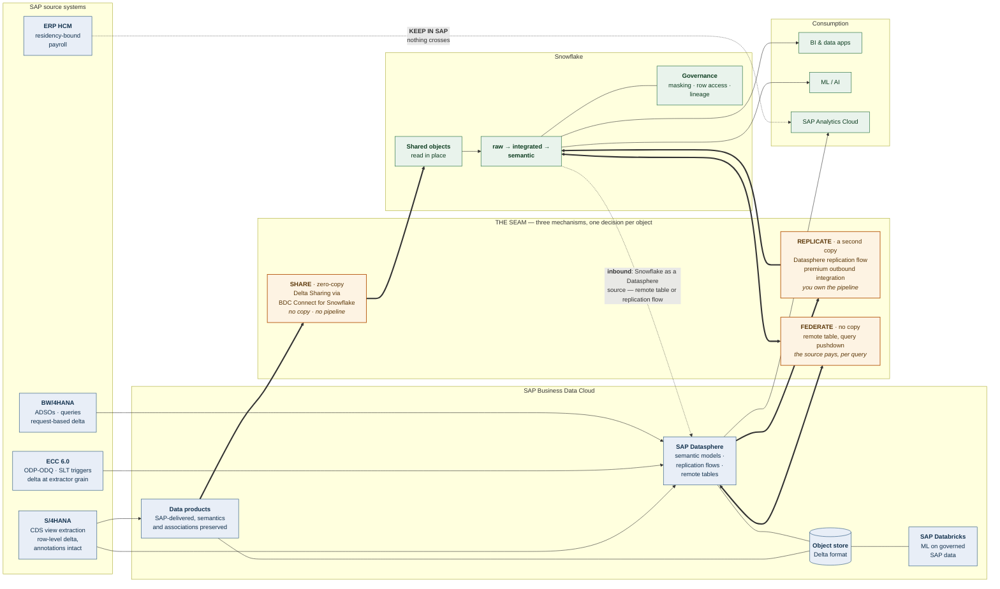
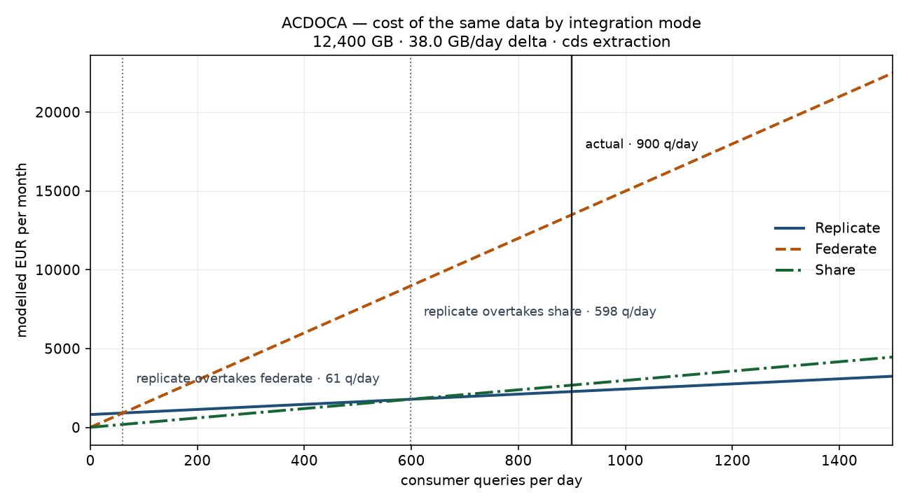

# SAP → Business Data Cloud / Datasphere → Snowflake

**The one page.** Everything else in this repo exists to defend it.

---

## The picture



The seam is the design surface. Everything to its left is SAP's problem, everything
to its right is Snowflake's, and the only interesting decisions in the whole
architecture are the ones made *in* it — once per object, not once per programme.

---

## The decision, made explicit

For every object, in this order. The order is the argument: the first five rules
**eliminate**, and only the sixth **chooses**.

| # | Rule | What it decides | Why it comes here |
|---|---|---|---|
| **R1** | Residency & personal data | A copy at rest outside the permitted region is out. If the object also carries personal data, a query result crossing the border is an export too — so nothing crosses and the workload stays in SAP. | A residency rule is not a number you can trade against a cheaper option. Put it after economics and one day economics wins. |
| **R2** | Delta capability | No delta above the size ceiling ⇒ no replication. Every cycle would be a full reload. | "We'll just replicate it" is a sentence about a table that has a delta. Most custom Z-tables do not. |
| **R3** | Freshness SLO | An SLO tighter than the schedule floor ⇒ no replication. Tighter than the producer's refresh ⇒ no share. | A copy is exactly as fresh as its last successful run, and a share is as fresh as its producer chose. |
| **R4** | Latency SLO **at peak concurrency** | A federated query that misses the SLO at month-end close ⇒ no federation. | Federation runs on the system that is also running the business. It passes on an empty system and fails at close. |
| **R5** | Share availability | Sharing needs an SAP-delivered data product, outbound. | Zero-copy is not a switch you flip on an arbitrary table. If the data product does not exist, building it is a project. |
| **R6** | Semantics | High-semantics objects prefer the share, within a stated cost premium. | Replication flattens currency conversion, hierarchies and CDS annotations. Someone then rebuilds them in Snowflake, at a cost that never appears in the pipeline's bill. |
| **R7** | Economics | Cheapest **surviving** mode wins. | Only now. |
| **R8** | Hybrid | Replicate the aggregate, federate the rare drill-down. | A dashboard and a line-item drill-down are two workloads, and only one of them justifies a copy. |
| **R9** | Join locality | Advisory: expose the modelled view, not the raw table. | If the joins are SAP-side, run them where the data is and let only the result cross. |

### The five outcomes

| Mode | What it is | Costs you | Fresh as of |
|---|---|---|---|
| **SHARE** | Delta Sharing via BDC Connect — Snowflake reads SAP data products in place | consumer compute only | the producer's refresh |
| **REPLICATE** | Datasphere replication flow into Snowflake tables | initial load + delta movement + a second copy at rest + outbound integration + a pipeline to operate | its last successful run |
| **FEDERATE** | Remote table with query pushdown; nothing persisted | source compute + egress, on every query | now |
| **HYBRID** | Replicated aggregate, federated detail | both, in proportion | mixed, by design |
| **KEEP_IN_SAP** | Model and report inside SAP; nothing crosses | nothing at the seam | n/a |

---

## The crossover — the number to put on screen

Replication is mostly **fixed** cost. Federation is mostly **variable**. Two
straight lines, and they cross:

```
                                 F_replicate − F_federate
  crossover (queries/day)  =  ───────────────────────────────
                              (v_federate − v_replicate) × 30
```

Below the crossover, federating is cheaper and a copy never pays itself back.
Above it, the copy is cheaper and federating quietly bills the ERP forever.

That single line converts an argument about preferences into an argument about
two numbers — the source's per-query cost and the pipeline's monthly cost — and
those are numbers a room can actually settle.

**Sharing changes the shape rather than the position.** It removes almost all of
the fixed cost (no pipeline, no second copy, no outbound metering) and *raises*
the marginal one, because reading a shared object prunes less well than reading a
native table. So a share wins decisively at moderate frequency on semantically
rich data, and loses to a plain copy on the hottest, highest-concurrency facts.
Anyone who tells you zero-copy always wins has not priced the hot path.



*Regenerate with `make decide`.*

---

## What this architecture refuses to do

- **It does not lift-and-shift the estate.** Replicating everything is the option
  that needs no architect, and on the worked catalog it costs roughly three times
  the decided mix — before counting the pipelines somebody then operates.
- **It does not treat zero-copy as free.** A share moves cost from fixed to
  variable and freshness from your schedule to someone else's promise. Both are
  trades, and both are written down.
- **It does not put governance downstream of cost.** Two HR objects in the worked
  catalog never cross the seam at all, and the register still prices what
  replicating them *would* have cost — because a constraint nobody has priced is
  a constraint somebody will eventually argue away.
- **It does not draw one arrow.** The inbound direction — Snowflake as a source
  for Datasphere, as a remote table or in a replication flow — is half of a real
  estate and is missing from most versions of this diagram.

---

## Where the numbers come from

Everything above is generated from `config/` and reproducible with `make demo`.
The cost figures are **illustrative order-of-magnitude placeholders**, not quotes:
replace `config/cost_model.yaml` with a real rate card and re-run. Decisions that
move under real rates were never really about architecture — which is the most
useful thing this artifact can tell you about your own estate.

SAP's integration surface moves quickly, and the mechanisms named here (BDC
Connect for Snowflake over Delta Sharing, premium outbound integration, Snowflake
as a replication-flow source) should be checked against current SAP documentation
before anyone commits a budget to them. What is durable is the decision procedure,
not the product matrix.

## Related

- [`reports/decisions.md`](../reports/decisions.md) — the register: every object, its mode, and why
- [`reports/simulation.md`](../reports/simulation.md) — the three modes executed locally
- [`docs/c-bdcda-study-map.md`](c-bdcda-study-map.md) — how this maps to the C_BDCDA exam domains
- [`docs/design/decisions/`](design/decisions/) — the ADRs behind each choice above
